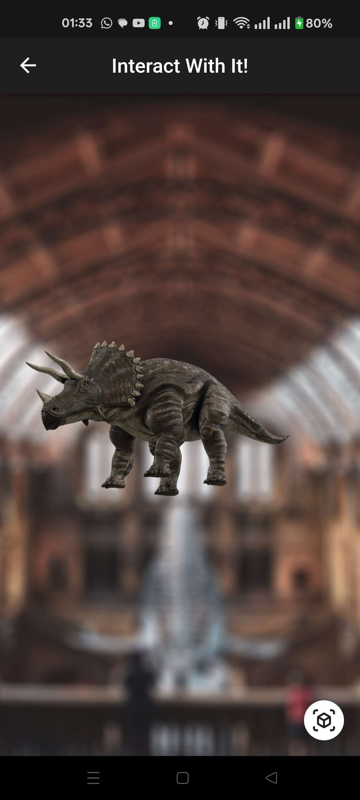

# Interactive Museum 

Flutter app for an interactive museum-style app.
Developed for a University project for the Human-Machine Interaction class.

---

### 🏛️ Project Overview

Inspired by Natural History Museums, this project aims to create an **interactive mobile app** that enhances the museum experience by making it **more engaging, informative, and fun** for visitors.

The app allows users to:

* 🎟️ Access an **online ticket office and store** for quick purchases.
* 🗺️ Explore the museum through an **interactive map**.
* 🎮 Participate in **challenges and mini-games** while learning about exhibits.

---

This project is only a prototype - Our idea was for in a real implementation, user location would be updated dynamically using something like iBeacon technology, allowing challenges and exhibit information to appear based on where the visitor is inside the museum.

For this prototype, navigation is simulated with on-screen arrows, and events trigger automatically as users move between rooms. To replicate the “Find the Item” challenge, there’s a 30% chance of correctly identifying the target item when pressing the camera button.

We also designed fictional museum layouts to demonstrate the potential user experience and interface flow.

---

### 📱 App Interface

Below are screenshots showcasing some of the app’s interface and main features.

  
  
  
  
  

